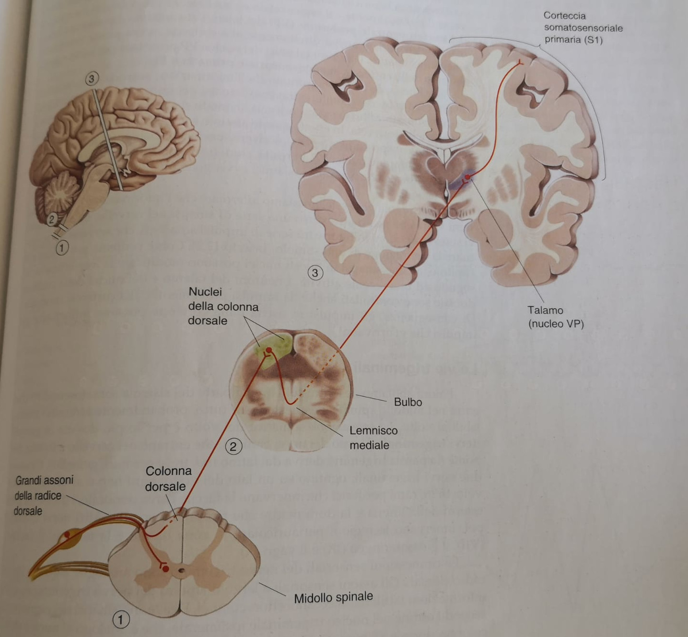
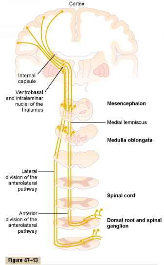
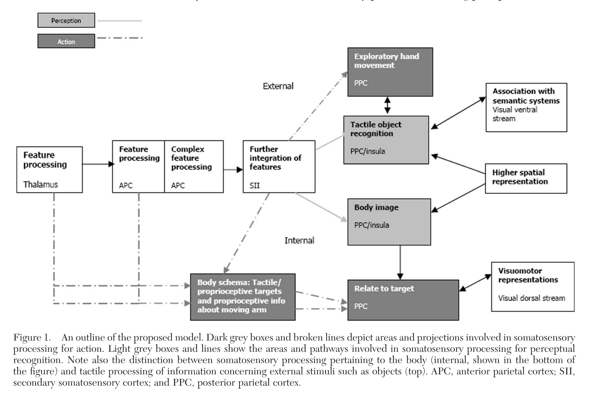
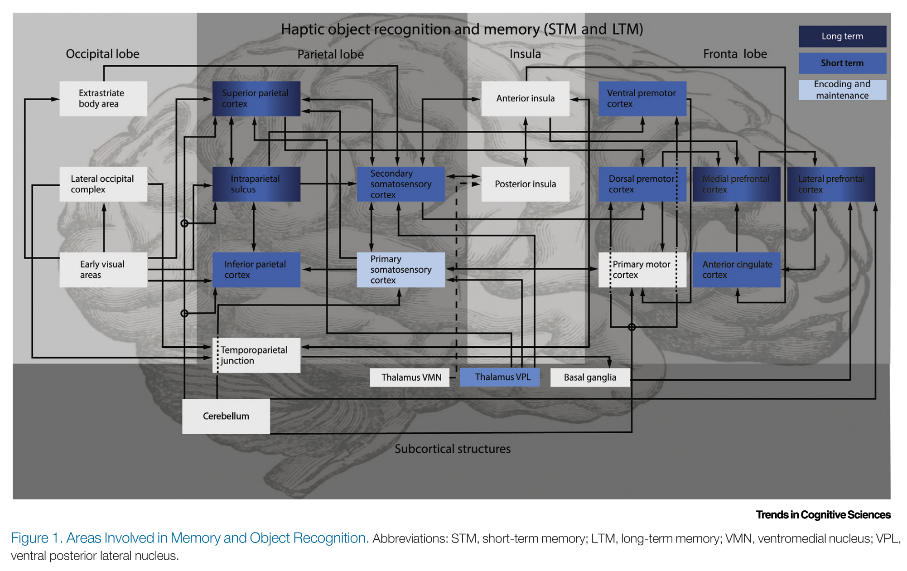
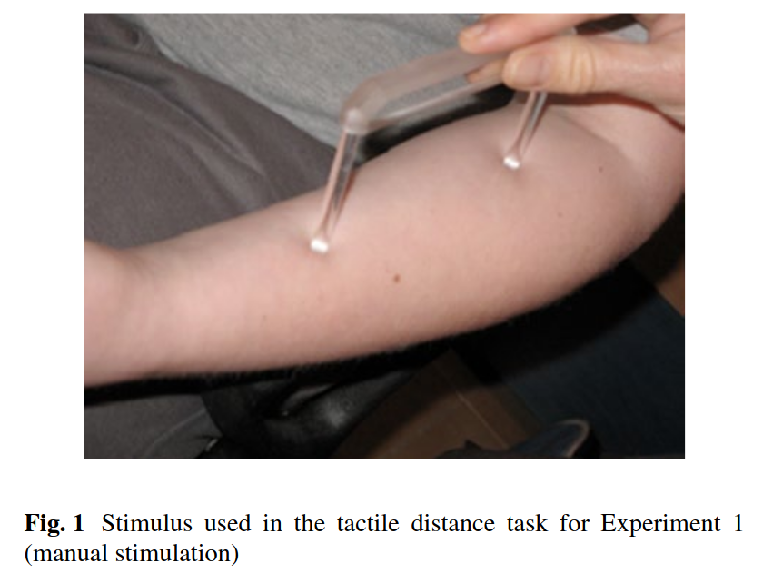
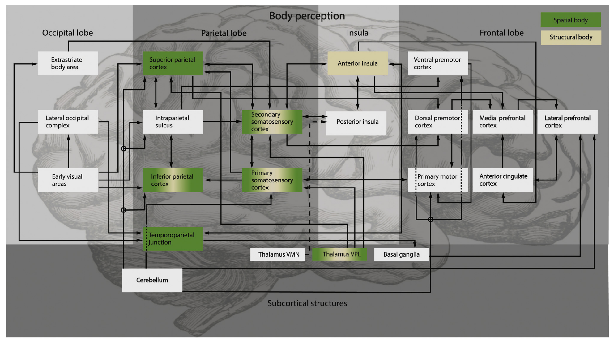
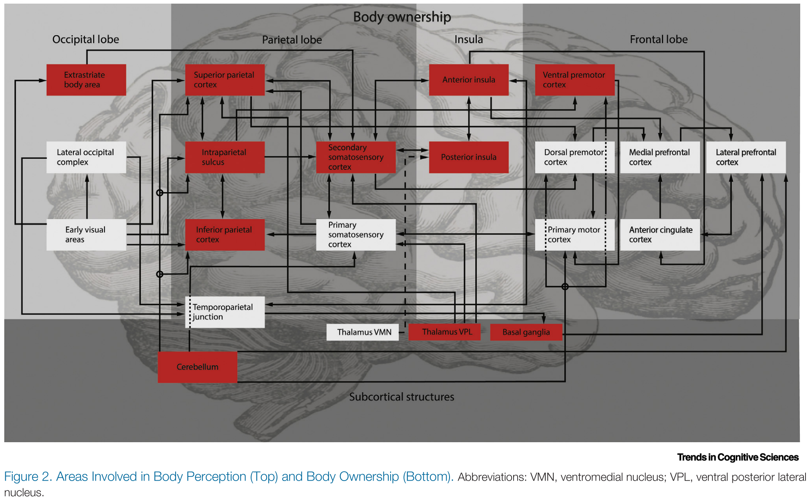
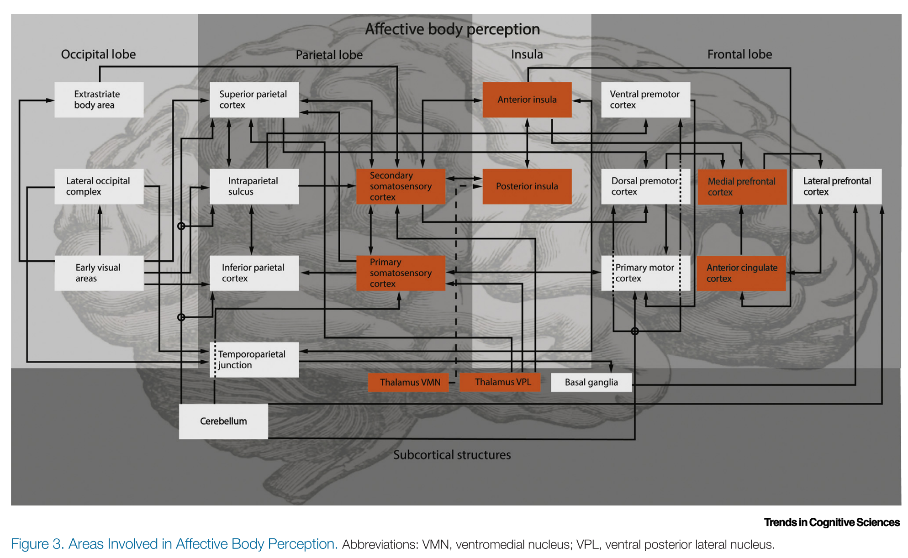
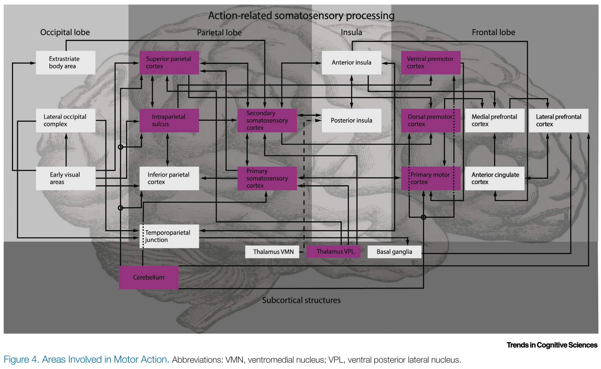

```{r setup, include=FALSE}
knitr::opts_chunk$set(echo = FALSE)
```

#  Somatosensation in the Brain | A Theoretical Re-evaluation and a New Model

## The Article

This article [@DeHaan2020] is an updated version of a previous review [@Dijkerman2007] (cited 322 times according to Scopus) where Dijkerman and De Haan proposed a somatosensory model inspired by the two-route model of visual system [@Goodale1992].

Based on:

- "Body Schema" and "Body Image" [@HEAD01111911]
- Multiple body representations [@Berlucchi1997]
- pathway from the APC via SII to the posterior insula for perceptual learning and recognition [@Mishkin1979]

# The somatosensory system

## The somatosensory system 1/2

<table>
<tr>
<td>
An ascending system, the **dorsal column–medial lemniscus pathway**, from the somatosensory receptors (Paccini, Merkel, Ruffini, Meissner) to the dorsal column in the spinal cord and subsequently arrives in the medulla where they decussate and terminate in the Thalamus (ventral posterior lateral nucleus).

Then, from the Thalamus to SI.
</td>
<td>
<div class="centered">

</div>
</td>
</tr>

</table>

## The somatosensory system 2/2

<table>
<tr>
<td>
A second ascending system, the **anterolateral system**, mainly deals with thermal and noxious stimuli and some tactile inputs. It also projects to the Thalamus.
</td>
<td>
<div class="centered">

</div>
</td>
</tr>

</table>


# The first Dijkerman - De Haan model

## Their first model

1. early processing in APC, then higher association areas
2. **recognition and perception** from the APC via SII to the posterior insula
3. **action** from the APC via SII to the PPC
4. **recognition and perception requires both insula and PPC**
5. **independency** between the two streams

<div class="centered">

</div>

# Problems with their first model

## 1. Independence between the two streams

**There is convincing evidence of crosstalk between pathways.**

Dissociations between the two routes depend on the precise task conditions and
there are now many examples of ‘perceptual information’ affecting action programming and
vice versa. ( _RHI impact on movement displacements and grasping actions_ )

1. the type of motor response given and whether this involves a predefined target;
2. visual versus proprioceptive targets when testing the effect of the illusion on motor responses;
3. active induction of the illusion involving movements made by the participant versus
passive tactile stimulation

## 2. Clear evidence of more than two pathways

**Somatosensory processing is not only for perception and the guidance of action.**

1. haptic object recognition
2. body perception
3. body ownership
4. affective processing
5. action

## 3. Focus on the tactile modality

Somatosensory processing ontributes to functions that are:

- inherently multimodal in nature
- involving cortical regions that process input from various modalities

**examples:**

- body perception relies on the _body matrix_
- haptic feature perception involves multimodal areas
- sensory processing about the hand during action is influenced by visual and somatosensory signals in the occipital and parietal cortex
- tactile memory involves multimodal processing in posterior parietal and frontal areas

# The new model

## Reviewing recent Literature

Reviewing the Literature, the Authors observed that:

1- there are observation concerned structures that they had omitted in the first model
2- these structures are all highly interconnected

This suggests either one comprehensive or several overlapping networks.

Therefore, the Authors identified five main networks in a interactive, distributed network.

## 0. The Cylinder Block 1/2

Cylinder block:

basic somatosensory processing unit dominated by somatosensory input.

1. SI in anterior parietal cortex (early processing)
2. SII
3. Thalamus

in SI simple features, such as stimulus location and duration, that lead to direction and velocity of a target moving on the body surface.

## 0. The Cylinder Block 2/2

This Cylinder block provides the input for 5 networks:

- haptic object recognition
- body perception
- body ownership
- affective processing
- action representation

## 1a. Haptic Object Recognition 1/2

Recognizing objects needs:

1. learning
2. active exploration

* Memory of shape characteristics = left superior parietal lobe + right cuneus
* sensory-guided moter activity = left posterior parietal lobe

the insular cortex is NOT involved in object recognition or that its role is limited to the affective aspects of objects

in addition to posterior parietal areas, the frontal lobes also play a role in haptic recognition beyond programming exploratory movements

## 1a. Haptic Object Recognition 2/2

<div class="centered">

</div>

## 1b. Tactile Memory 1/4 | Working tactile memory

- monkeys: damaged SII impairments in tactile discrimination learning
- fMRI humans: anterior and superior parital cortex, SMA, dorsolateral and anterior cingulate cortex
- multimodal working memory (visuo-tactile amtrices): posterior parietal, dorsolateral prefrontal, anterior cingulate networks

## 1b. Tactile Memory 2/4 | Long-term tactile memory

prefrontal and parietal involvement in long-term tactile memory as well as a multimodal memory representation.

vision + somatosensory: activations in the medial and superior frontal gyrus and
the superior parietal lobe including the intraparietal sulcus.

## 1b. Tactile Memory 3/4 | Imagery

Imaging tactile features of an object accelerate reaction times to tactile but not auditory stimuli

Tactile imagery activation in:
- SI
- retrosplenial cortices
- precuneus
- prefrontal cortex $\leftarrow$ top-down activation of a visual representation of a haptically explored object: haptic object recognition is multimodal!

## 1b. Tactile Memory 4/4

<div class="centered">

</div>

## 2. Body perception 1/5

Body perception depends on basic and higher-order representations.

* ***Spatial body information*** location of, distance of body parts, speed of touch sensation ($\simeq$ body image?)
* ***Structural body information*** knowledge and awareness of the positions of body parts, knowing the left and right side ($\simeq$ body schema?)

Structural and spatial representations are dissociable but they share underlying neural networks and show related functional representations.

## 2. Body Perception 2/5 | Structural representation

- behavioural study suggests that there is a mental body representation structured in categorical body parts, with the joints as boundaries

- structural aspects of body representation affect early somatosensory processing (N80 from controlateral SI)

- finger agnosia and left-right disorientation: inferior parietal lobe damage, right anterior insula

## 2. Body Perception 3/5 | Spatial representation

Spatial aspects of body representations often studied with _tactile distance estimation task_ [@Spitoni2013].

<div class="centered">

</div>

## 2. Body Perception 4/5 | Spatial representation

Using the _tactile distance estimation task_ it was observed the activation of:

- bilateral inferior and superior parietal areas 
- right parieto-occipitotemporal junction.

Thus, parietal areas appear to be mainly responsible for processing spatial input.

## 2. Body Perception 5/5 

<div class="centered">

</div>


## 3. Body Ownership 1/2

***Definition:*** the feeling that a body (or part of it) belongs exclusively to you

- three networks contribute in **anosognosia for hemiplegia**: the premotor loop, the limbic system and the ventral attentional network [@Pacella2019]

- **somatoparaphrenia** mainly occurs after right hemispheric damage, usually
posterior (temporoparietal) or insular but occasionally subcortically [@Vallar2009]

- in **somatoparaphrenia** are involved frontal (middle and inferior frontal gyrus) and subcortical (amygdala, hippocampus, thalamus, basal ganglia, white matter, internal capsule posterior limb) structures in addition to the postcentral gyrus [@Moro2016]

- **RHI**: ventral premotor and posterior parietal areas, the EBA, the cerebellum, and the putamen to be involved + insula [@Ehrsson2004]

## 3. Body Ownership 1/2

<div class="centered">

</div>

## 4. Affective Processing 1/4

An important, but not the only, sensory channel for the positive affective aspect of touch is the ***c-tactile system***

Unmyelinated c-fibres in hairy skin respond best to slow (1–10 cm/s)
stroking with a soft brush or hand and at skin temperature (about 34°C), suggesting sensitivity
for skin-on-skin contact [@Rolls2010].

These fibers directly aim to the Insular cortex.

The areas activated by affective touch are dissociable, but also overlapping the areas activated by disctiminatory tactile stimuli.


## 4. Affective Processing 2/4

- ***Disciminative touch***: SI, SII, the left lateral inferior premotor cortices, the inferior parietal cortex, the SMA, and bilateral angular gyri and medial prefrontal areas.

- ***Affective touch***: bilateral network posterior and anterior insula, the postcentral primary and secondary somato-sensory cortex, the putamen, the thalamus, the frontal operculum, and the medial prefrontal cortex.

  1. feeling affective touch activates the posterior insula
  2. imagining affective touch activated the anterior insula
  3. observing affective touch activates the posterior insula [@Morrison2011]

This suggests that the anterior insula is particularly important for the affective interpretation of touch.

## 4. Affective Processing 3/4

There are many other tactile stimuli that are socially relevant:

- holding hands
- hugging
- squeezing, etc

1. substantial overlap of the neural mechanisms underlying social and affective touch
2. both involve activation of somatosensory as well as social brain areas

## 4. Affective Processing 4/4

<div class="centered">

</div>

## 5. Action Representation 1/3

Somatosensory (proprioception) information is used for:

1. starting position to plan the action
2. end position when we move towards a target location on the body

## 5. Action Representation 2/3 | some principles

1. there is substantial crosstalk between the networks involved in action and perception.
2. a number of recent studies have specifically looked at the interplay between
somatosensation and other sensory domains
3. dissociation in the haptic domain between grasping and reaching
movements. Trajectories are different [@Karl2013]

## 5. Action Representation 3/3

<div class="centered">

</div>

# Conclusions

## Conclusions and questions

This model is an interactive, distributed framework.

It shows functional specificity, but somatosensory processing in its broadest sense involves a network of cortical and subcortical areas that shows a more flexible organization than the first model previously assumed.

***Questions***

1. A central thesis here is the multimodal aspect of the networks that are informed by somatosensory information. The mechanisms are not well understood.

2. Affective somatosensory processing is not reliant on C-fibres
only, and we need to look into the inter-action between these systems.

3. Time course of the activation of the different networks.

## References