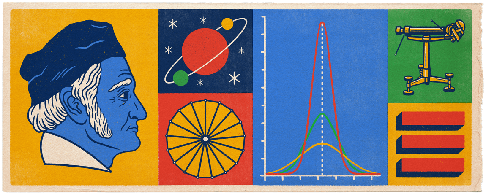

```{r setup, include=FALSE}
knitr::opts_chunk$set(echo = FALSE)
library(pwr)
library(TrialSize)
```

## $243^{th}$ Gauss' Birthday!

<div class="centered">

</div>

## Eh??


## Why Sample Size is so important?

- It says _when_ you should do your stats
- It gives an idea of the actual resources we should put into a project
- **It tells us when the numerosity of our sample is actually representative of the statistical population**

In census the sample size is the whole population!

## What is a sample size?

Generally speaking, the larger the sample size, the more accurate are your estimates and your statistics.

However we have a lot of limitations: availability of participants, time contraints, money constraints, etc...

Therefore the _optimum_ sample size is the minimum number of participants needed to have statistically representative data.

## Power of a statistical test

In frequentist statistics (NHST), some fundamental concepts are:

- first type error ($\alpha$) -- typically set at 5\% (0.05) (False Positives)
- second type error ($\beta$) (False Negatives)

The power of a statistical test is given by $1-\beta$.

**It is the probability to reject the null hypothesis when it is false.**

Generally, accepted values of power are: 80\%, 90\%, 95\% and 99\%,
which means $\beta = 20\%, 10\%, 5\%, 1\%$.

**The sample size is the number of observations required, to obtain a statistically significant result
in the power\% of cases, given a specific effect size.**

## Effect size of a statistical test

First introduced by Cohen 1988, they demonstrated their importance in short time.

The effect size of a test is a (usually) standardized measure of the dimension of
an effect (difference between groups, covariation, etc...) that should always
been presented altogether with a (significant) p-value.

If the p-value says that there is an effect, the effect size says us if the effect
is worth to be mentioned.

The effect size is an indication of how much of the control observation is lower (or higher)
than the experimental observations.

## Effect size and % of difference

<tiny>Let's use the Cohen's $d = \frac{\hat{\mu}_1 - \hat{\mu}_2}{\hat{\sigma}_{12}} \leftarrow$  z-score.</tiny>

| Nominal size | Effect size | % control < experimental observations |
|--------------|-------------|--------------------------------------------------------------|
|              | 0.0         | 50%                                                          |
| Small        | 0.2         | 58%                                                          |
| Medium       | 0.5         | 69%                                                          |
| Large        | 0.8         | 79%                                                          |
|              | 1.4         | 92%                                                          |

https://rpsychologist.com/d3/cohend/ $\leftarrow$ interesting visualization

## Sample Size $n = f(1-\beta,ES)$ 1/3

The sample size is computed as a function of the (desired) power ($1-\beta$) and effect size ($ES$).

It is the _optimum_ sample size needed to have the desired power, specifying a certain effect size.

Taking for example the case of a single sample and one-tail t-test, with the Cohen's $d$ as effect size, it solves for $n$ the following system:

```{r equation}
eq <-  noquote(paste(expression("Pr_t(q,\\nu,c) = 1-\\beta\\\\ \\nu = (n-1)\\\\q = Q_t(\\alpha , \\nu)\\\\c = \\sqrt{n}\\times d")))
```

$$
\begin{cases} `r eq` \end{cases}
$$

## Sample Size $n = f(1-\beta,ES)$ 2/3

$\nu = n-1$ these are the degrees of freedom of the Student's t distribution

$q = Q_t(\alpha,\nu)$ this is the quantile of the t distribution at $\alpha$ (usually 0.05)
 with these d.o.f.

$c = \sqrt{n}\times d$ is the non-centrality parameter of the t distribution. Larger the sample, more deviated is the distribution.
 
$Pr_t(q, \nu, c)$ is the integrate of the curve of the t distribution stopped at quantile $q$.


## Sample Size $n = f(1-\beta,ES)$ 3/3

**_EXAMPLE_**

$d = 0.3$; $1-\beta = 0.8$; $\alpha = 0.05$

$n = 70$

$\nu = 69$

$q = Q_t(\alpha,\nu) = Q_t(0.05,69) \simeq 1.67$

$c = \sqrt{n}\times d = \sqrt{69}\times 0.3 \simeq 8.31\times0.3 \simeq 2.49$

$Pr_t(q, \nu, c) = Pr_t(1.67, 69, 2.49) = 0.7932814$

## Sample Size $n = f(1-\beta,ES)$ *

```{r}
x <- seq(-4-2.49, 4, length=1249)
hx <- dt(x,df = 69,ncp = -2.49)
plot(x,hx,type="l")
xx <- x[x<(-1.67)]
yy <- hx[x<(-1.67)]
xx <- c(xx,xx[length(xx):1])
yy <- c(yy,rep(times=length(yy),0))
polygon(x=xx,y=yy,col="red")
text(x=-2.7,y=0.15,labels = expression("Power = 80%"), ylab="", xlab="")
abline(v=-2.49,col="green")
abline(v=-1.67,col="purple")
legend("topright",col=c("green","purple"),legend=c("c = -2.49","q = -1.67"),lty=c(1,1))
```

* Values are mirrored.

## A question for you:

Recalling that: *the sample size is the number of observations required, to obtain a statistically significant result
in the power\% of cases, given a specific effect size.*

Do you think that if I reach a statistically significant result with less observations than those required by the sample size,
it is OK?

Why?

## My answer

**No, it is not OK.**

The motivation is that the sample size if the minimum number of observations (subjects) required to have a representative sample of the statistical population.

Smaller samples can be more prone to (less obvious) outliers, therefore there is not only the risk to have a greater second type error, but also a first type error.

## How we can compute a sample size?

Here I present three main ways:

- By means of the functions first proposed by Cohen (1988)
- By means of the functions proposed by Chow SC, Shao J, Wang H. (2008)
- By means of simulations

When we compute the sample size, we need to think to our hypotheses and to the specific contrasts of interest.

We also need to think to the possible effect size.

How to determine it?

- pilot data
- data in literature
- standard tables

# The _pwr_ package

## How we can compute a sample size with Cohen's formulas?

In order to use the Cohen's formular, there is the package _pwr_ in R.

In this package there are several functions that allow us to compute the sample size in different cases.

## Cohen's formulae in R 1/2

| function       | power calculations for                  | ES standard values              |
|----------------|-----------------------------------------|---------------------------------|
| `pwr.2p.test`    | two proportions (equal n)               | h - S: 0.2; M: 0.5; L: 0.8      |
| `pwr.2p2n.test`  | two proportions (unequal n)             | h - S: 0.2; M: 0.5; L: 0.8      |
| `pwr.anova.test` | balanced one way ANOVA                  | f - S: 0.1; M: 0.25; L: 0.4     |
| `pwr.chisq.test` | chi-square test                         | w - S: 0.1; M: 0.3; L: 0.5      |
| `pwr.f2.test`    | general linear model                    | f2 - S: 0.02; M: 0.15; L: 0.35  |

## Cohen's formulae in R 2/2

| function       | power calculations for                  | ES standard values              |
|----------------|-----------------------------------------|---------------------------------|
| `pwr.p.test`     | proportion (one sample)                 | h - S: 0.2; M: 0.5; L: 0.8      |
| `pwr.r.test`     | correlation                             | r - S: 0.1; M: 0.3; L: 0.5      |
| `pwr.t.test`     | t-tests (one sample, 2 sample, paired)  | d - S: 0.2; M: 0.5; L: 0.8      |
| `pwr.t2n.test`   | t-test (two samples with unequal n)     | d - S: 0.2; M: 0.5; L: 0.8      |

with the function _cohen.ES_ you can have all the standard effect sizes.

## Structure of the functions in the pwr package

More or less, all the pwr.?.test have the same parameter to be specified:

- power: a value within 0 and 1, stating the desired power
- sig.level: the $\alpha$. If you do not specify it, by default is = 0.05
- alternative: "two.sided", "greater", "less"
- (different for each function): the effect size
- (only in some function) type: "two.sample" (comparing two independent groups), "one.sample" (one group against $\mu$), "paired" (comparing the same group in two different times)

## Using the pwr package

Let's compute the sample size previously seen

```{r, echo =TRUE}
library(pwr)

pwr.t.test(d = 0.3, power = 0.8, sig.level = 0.05,
           type = "one.sample", alternative = "greater")
```

## pwr::pwr.t.test 1/3

The parameters are:

- d: the effect size
- sig.level	
- power	
- type: "two.sample", "one.sample", "paired"
- alternative: "two.sided", "less", "greater"

## pwr::pwr.t.test 2/3

**_EXAMPLE_**

We want to train black and white cats in jumping at a command.

If our hypothesis is that black cats will jump more, how many cats we have to train?

Let's use a power of 80\%, and a medium effect size.

## pwr::pwr.t.test 3/3

**_EXAMPLE_**


```{r}
d <- cohen.ES( test = "t" , size = "medium" )
pwr.t.test( d = d$effect.size , power = 0.8 , alternative = "greater")
```


## pwr::pwr.anova.test 1/3

The function is pwr.anova.test, and it works only with one-way balanced designs.

That means that if we have a multifactorial design, we have to force it as a one-way design.

The null hypothesis is that in all levels of the factor the means are equal, the alternative hypothesis is that there are at least two levels that are statistically different from each other.

## pwr::pwr.anova.test 2/3

**_EXAMPLE_**

We have an "Empathy for pain" experiment.
In this experiment, we collect physiological data during the vision of 3 typologies of videos:
- Control video, A video of a Syringe penetrating an hand, A video of a Q-tip touching a hand
In two perspectives:
- 1PP, 3PP
The colour of the Q-tip or syringe can change:
- Blue, green, pink

Therefore, the design is a $3\times2\times3$. If we translate it as a one.way design, the total number of "groups" (k) is $18$.

However, our hypothesis is that there is a difference between the Syringe videos in the 1PP and 3PP, therefore touching two factors: $3\times2$. The total number of groups to take into account is $6$.


## pwr::pwr.anova.test 3/3

**_EXAMPLE_**

Let's use a medium effect size $f = 0.25$

```{r, echo =TRUE}
pwr.anova.test(k = 6, f = 0.25, power = 0.8, sig.level = 0.05)
```

## pwr::pwr.f2.test 1/3

The function is pwr.f2.test.

Formally, it is for multiple regressions, but it does the same things seen in pwr.anova.test with much more flexibility.

You do not need to force your design into a "one-way" study, and you can take into account covariates.

The parameter that takes this function are:

- u: degrees of freedom for numerator
- v: degrees of freedom for denominator
- f2: effect size
- sig.level	
- power	

## pwr::pwr.f2.test 2/3

You need to give to the function the number of degrees of freedom for the numerator.
In this way the function will return the number of degrees of freedom of the demoninator.
From this value we can estimate the sample size.

$u$ is equal to the number of levels of the factor/interaction minus 1.
$v$ is the degrees of freedom of the residuals.

The sample size is $u + v + 1$.

## pwr::pwr.f2.test 3/3

**_EXAMPLE_**

At the previous study, we add the evaluation of embodiment on a likert scale of the hand seen in the videos.

The d.o.f. at the numerator are now: $2\times3\times1 - 1$

Let's use a medium effect size $f2 = 0.15$

```{r, echo =TRUE}
pwr.f2.test(u = 5, f2 = 0.15, power = 0.8, sig.level = 0.05)
```

## Exercises A 1/3

1. Compute the required sample size to understand if females are more creative than males, using a small effect size and a power = 80\%.

2. Estimate the sample size necessary to understand if people feel more energic after a hot shower, with a moderate effect size and a power = 90\%.

3. Repeat, with a small effect size and power = 80\%.

## Exercises A 2/3

4. We have three groups of people: volleyball players, basketball players and normal people. Your hypothesis is that normal people are less reactive in a go-no-go experiment. Find the total number of partecipants required with a medium effect size and a power of 99\%.

## Exercises A 3/3

5. In an experiment concerning memory we have three groups: the coffee group, the tea group and the water group, and two between-subjects conditions: sleeping deprivation and normal sleeping. Find the sample size per group, with a power of 80\% and a large effect size.

# The _TrialSize_ package

## How we can compute a sample size with Chao et al.'s formulas?

We can use the _TrialSize_ package.

It has 80 different functions to compute the sample size.

Some of interest are:

- `ANOVA.Repeat.Measure`
- `CrossOver.ISV.Equality`
- `CrossOver.ISV.NIS`

## TrialSize::ANOVA.Repeat.Measure 1/2

$H_0: \forall \mu_{i} = \mu_{(j:k) \neq i}$; $H_1: \exists \mu_{i} \neq \mu_{(j:k) \neq i}$ 

This function needs:

- alpha
- beta: be careful, the power is $1-\beta$. If you want power = $80\%$, beta = $0.2$
- sigma: the sum of the variance components
- delta: the difference that we consider as meaningful
- m: the total number of Bonferroni adjustments needed for post-hoc tests

**No space for standard ES!**

_Suggestion: in terms of Cohen's d, delta = ES $\times \sqrt{sigma}$_

## TrialSize::ANOVA.Repeat.Measure 2/2

**_EXAMPLE_**

We use again the same example seen before.

Our physiological data have been transformed into z-scores, therefore a meaningful difference may be 1.5

We set the sum of the variances as $\sqrt{delta\div ES^2}$ = $\sqrt{1.5\div0.5^2} \simeq 2.45$

```{r, echo = TRUE}
s.size <- ANOVA.Repeat.Measure(alpha = 0.05, beta = 0.2, sigma = 2.45,
                               delta = 1.5, m = 6)
s.size
```

## TrialSize::CrossOver.ISV.Equality 1/3

$sigma^T$ is the within-subjects variance for treatment T

$H_0: \forall \sigma^{T^1}_{1} = \sigma^{T^2}_{2}$; $H_1: \exists \sigma^{T^1}_{1} \neq \sigma^{T^2}_{2}$ 

This function needs:

- alpha
- beta: be careful, the power is $1-\beta$. If you want power = $80\%$, beta = $0.2$
- sigma1: within-subject variance of treatment 1
- sigma2: within-subject variance of treatment 1
- m: for each subject, there are m replicates

_Suggestion: think sigmas in terms of percentages or z-scores_

## TrialSize::CrossOver.ISV.Equality 2/3

**_EXAMPLE_**

Cross-Over design with treatment and placebo condition, 5 trainings per week, done for two weeks.

Data are in z-scores

```{r, echo = TRUE}
CrossOver.ISV.Equality(alpha = 0.05, beta = 0.2,
                                 sigma1 = 1, sigma2 = 2, m = 10)
```

## TrialSize::CrossOver.ISV.Equality 3/3

**_EXAMPLE_**

[1] 30.0000000  0.7823326

[1] 31.0000000  0.7855731

[1] 32.0000000  0.7886677

[1] 33.0000000  0.7916271

[1] 34.0000000  0.7944611

[1] 35.0000000  0.7971784

[1] 36.0000000  0.7997869

[1] 37.0000000  0.8022938 $\leftarrow$ we reached the desired power!


## TrialSize::CrossOver.ISV.NIS 1/3

NIS stands for Non-Inferiority/Superiority of Intra-Subject Variability in Crossover Design

$\rho = \sigma^{T^1} \div \sigma^{T^2}$

$H_0: \rho \geq \delta$; $H_1: \rho < \delta$ 

This function needs:

- alpha \& beta
- sigma1 \& sigma2: within-subject variance of treatment 1 and 2
- m: for each subject, there are m replicates
- margin: margin=$\delta$, the true ratio of sigma1/sigma2

_Suggestion: think sigmas in terms of percentages or z-scores_

## TrialSize::CrossOver.ISV.NIS 2/3

**_EXAMPLE_**

Same design seen before. When the experimental treatment will give a better outcome than placebo? Data are in z-scores.

```{r, echo = TRUE}
CrossOver.ISV.NIS(alpha = 0.05, beta = 0.2,
                                 sigma1 = 1, sigma2 = 2, m = 10,
                  margin = 2)
```

## TrialSize::CrossOver.ISV.NIS 3/3

**_EXAMPLE_**

[1] 24.0000000  0.7829748

[1] 25.0000000  0.7870264

[1] 26.0000000  0.7908511

[1] 27.0000000  0.7944695

[1] 28.0000000  0.7978998

[1] 29.000000  0.801158 $\leftarrow$ we reached the desired power!

## Exercises B 1/3

1. Estimate the required sample size for a repeated measures anova design, with a $3 \times 2 \times 3$ within-subjects design. You decided that the difference should be half of the overall variance. The power is 90\%.

2. Repeat the same exercie with a $2 \times 2$ design.

## Exercises B 2/3

4. We want to apply two different trainings in a cross-over design. Every treatment is repeated 20 times. We want to know how patients to collect to understand if the variances of the two treatments are different. Power = 99%, we expect that the variance of one treatment is 1.5 the variance of the other treatment.

## Exercises B 3/3

5. Same exercise, this time we want to know how many patients we need to be sure that one treatment will not have a larger intra-subjects variance than the other treatment. Every treatment is repeated 20 times. Power = 99%, we expect that the variance of one treatment is 1.5 the variance of the other treatment. We expect that the true ratio between the two variances is 1.

# Simulations

## What is a simulation?

"By data simulation, we simply mean the generation of random numbers from a stochastic process that is described by a series of distributional statements, such as $\alpha_i \sim Normal(\mu, \sigma^2_{\alpha})$" (Kéry and Royle, 2016)

In R, this simple simulation can be done as follows:

```{r, echo = TRUE}
rnorm(n = 5, mean = 2, sd = 1)
```

Larger the simulation, more similar to the distribution are the data.

## Simulation over a gaussian distribution

1000 random samplings with mean 0 and standard deviation 1.

```{r}
x <- seq(-4, 4, length=100)
hx <- dnorm(x)
plot(x = x , y = hx , type = "l" , col = "red")
points(density(rnorm(1000)),type="l")
legend( "topright" , lty = c( 1 , 1 ) , col = c( "red" , "black" ) , legend = c("Gaussian" , "Simulated"))
```

## Why using statistical simulation to compute sample size?

For complex models, it is difficult to provide a good estimate of power without the use of simulation.

Simulations repeatedly generate random data (at least 1000 times) based on one’s predefined model,
then analyze each data set and count the proportion of results that are significant.

That proportion is the estimated power for the model.

We increase the number of "observations" until we reach the desired power.

## A simple example 1/3

Let's use simulation to determine the sample size for a t-test, with effect size Cohen's d = 0.8 and power = 80\%.

If we use the analytical functions:

```{r, echo = TRUE}
pwr.t.test( d = 0.8 , power = 0.8 )
```

## A simple example 2/3

$d = (\mu_1 - \mu_2) \div \sigma^2_{12} \rightarrow 0.8 = (\mu_1 - 0) \div \sigma^2_{12} \rightarrow$
$0.8 = (\mu_1 - 0) \div 1 \rightarrow \mu_1 = 0.8$

```{r, echo = TRUE}
out <- rep(NA , times = 10000)
for ( i in 1:10000){
  y1 <- rnorm( 25 , mean = 0.8 )
  y2 <- rnorm( 25 )
  out[i] <- t.test( y1 , y2 )$p.value
}
paste( "The power for 25 participants is:" , mean( out < 0.05 ))
```

## A simple example 3/3

```{r, echo = TRUE}
out <- matrix(NA , nrow = 1000 , ncol = 10)
n <- c(10 , 15 , 20 , 25 , 30 , 35 , 40 , 45 , 50 , 55) # seq( from = 10 , to = 55 , by = 5 )
colnames( out ) <- n
i_column <- 1 # index variable
repeat{
  for ( i in 1:1000){
    y1 <- rnorm( n[ i_column ] , mean = 0.8 )
    y2 <- rnorm( n[ i_column ] )
    out[ i , i_column ] <- t.test( y1 , y2 )$p.value
  }
  if( mean( out[ , i_column] < 0.05) >= 0.8) break;
  i_column <- i_column + 1
}

apply(out[ , 1:i_column]<0.05 , 2 , mean)
```

## Simulation of an ANOVA 1/3

$y \sim Intercept + condition \times perspective$, a $3 \times 2$ design 

```{r, echo = TRUE}
## we choose our effects of the IV on the DV
intercept <- 0
condition <- c(  0 , 0 )
perspect  <- 0
cond_per  <- c( 0 , 0.8 )

n_subj    <- 30
## we create our dataframe with the IV
data.tmp  <- as.data.frame(
  expand.grid( ID = 1:n_subj,
               conditions = factor(1:3),
               perspective = factor(1:2) )
)

```

## Simulation of an ANOVA 2/3

```{r, echo = TRUE}
mm <- model.matrix(~conditions*perspective,data=data.tmp)
## we start computing our DV
data.tmp$y <- intercept + mm[,2] * condition[1] +
                          mm[,3] * condition[2] +
                          mm[,4] * perspect[1] +
                          mm[,5] * cond_per[1] +
                          mm[,6] * cond_per[2]
## this is a shorter way that is doing the same thing
data.tmp$y <- rowSums( model.matrix( ~ conditions * perspective ,
                                     data = data.tmp ) %*%
              c( intercept , condition , perspect ,cond_per ) )
## we add some stocastic noise to the DV
data.tmp$y <- data.tmp$y + rnorm( nrow( data.tmp ) )

data.tmp
```

## Simulation of an ANOVA 3/3

```{r, echo = TRUE}
summary( aov( y ~ conditions*perspective +
                Error(ID/conditions*perspective) , data= data.tmp) )
```

## Computing the power of an ANOVA 1/3

```{r, echo = TRUE}
out <- matrix(NA , nrow = 1000 , ncol = 39)
n <- seq(from = 10, to = 200, by=5)
colnames(out) <- n
i_column <- 1 # index variable

## we choose our effects of the IV on the DV
intercept <- 0
condition <- c(  0 , 0 )
perspect  <- 0
cond_per  <- c( 0 , 0.8 )
```

## Computing the power of an ANOVA 2/3

```{r, echo = TRUE}
repeat{
  for(i in 1:1000){
    data.tmp  <- as.data.frame(
       expand.grid( ID = 1:n[ i_column] ,
               conditions = factor(1:3),
               perspective = factor(1:2) )
    )
    data.tmp$y <- rowSums( model.matrix( ~ conditions * perspective ,
                                     data = data.tmp ) %*%
              c( intercept , condition , perspect , cond_per ) ) +
      rnorm( nrow(data.tmp) )
    out[ i , i_column ] <- summary( aov( y ~ conditions*perspective +
                Error(ID/conditions*perspective) ,
                data= data.tmp) )$`Error: Within`[[1]][2,5]
    
  }
  if( mean( out[ , i_column] < 0.05 ) >= 0.9 ) break;
  i_column <- i_column + 1
}
```

## Computing the power of an ANOVA 3/3

```{r, echo = TRUE}
apply(out[ , 1:i_column]<0.05 , 2 , mean)
```

```{r}
plot(x = n[1:i_column] , y = apply(out[ , 1:i_column]<0.05 , 2 , mean),
     type = "b" , xlab = "Sample size" , ylab = "Power" )
abline( h = 0.8 , col = "red" )
```

## Define the coefficient to check 1/9

One typical problem is: "how do I know in which coefficient I have to put my effect size?"

That depends on your hypothesis.

Is your main hypothesis involving the hierarchically higher interaction, or a lower order coefficient?

Among all coefficients, you should think to which contrast if relly important for your sample size.

## Define the coefficient to check 2/9

For example, if you have a control and an experimental group,
and your hypothesis is that there will be a difference between
the two groups in condition A compared to a baseline, you should 
use the coefficient that represents that interaction.

## Define the coefficient to check 3/9

In this case we should have:

- Group factor: levels Experimental, Control
- Condition factor: levels baseline, A, B, ...?

For both factors we can use the treatment coding for the contrast matrix.

In this matrix all coefficients are the differences with a "baseline" level.

## Define the coefficient to check 4/9

Thus, in the moment we simulate our data set we should declare these aspects

```{r, echo = TRUE}
    data.tmp  <- as.data.frame(
       expand.grid( ID = 1:n[ i_column] ,
               conditions = factor(c("baseline","A","B")),
               group      = factor(c("experimental","control")) )
    )
```

## Define the coefficient to check 5/9

We check the contrasts matrices

```{r, echo = TRUE}
    contrasts( data.tmp$conditions ) 
    contrasts( data.tmp$group ) 
```

## Define the coefficient to check 6/9

We change the contrasts

```{r, echo = TRUE}
    contrasts( data.tmp$conditions ) <- contr.treatment( n = 3 , base = 3 )
    contrasts( data.tmp$group ) <- contr.treatment( n = 2 , base = 1 )
    
    contrasts( data.tmp$conditions ) 
    contrasts( data.tmp$group ) 
```

## Define the coefficient to check 7/9

The coefficients for interactions are simply given by the multiplication
of the contrasts matrices of the main (and lower-order interactions)
involved in the interaction of interest.

A simple way to understand which is this coefficient is just give a look
to the contrast matrix of the whole design.

```{r, echo = TRUE}
model.matrix( ~ conditions * group ,
              data = data.tmp )
```

## Define the coefficient to check 8/9

- `(Intercept)` is the first one, and it is always = 1
- `condition1` is the second one, and it is A - baseline
- `condition2` is the third one, and it is B - baseline
- `group2` is control - experimental
- `conditions1:group2` is the "A - baseline" difference for the control group, minus the same difference but for the experimental group
- `conditions2:group2` is the "B - baseline" difference for the control group, minus the same difference but for the experimental group

**Question:** Which coefficients we should use?

## Define the coefficient to check 9/9

Therefore, when we create our coefficients, we should put the required effect size in *that* coefficient:

```r

## we choose our effects of the IV on the DV

intercept <- 0

condition <- c(  0 , 0 )

group      <- 0

cond_grou  <- c( 0.8 , 0 ) ## <- this should change as follows:
```


## Infinite interactions and maximum sample size constraints 1/3

The `repeat` loop, without the `break` instruction, can go forever.

Until now we put the break **only if** we reach the desired power.

_But what if we never reach the desired power?_

And what if we have constraints in collecting samples from a particular population?

We just need to put an additional condition in the `if ... break;` part of the code.

## Infinite interactions and maximum sample size constraints 2/3

We need to write "if the sample size is greater or equal than X, then break the loop"

```r
repeat{
  for(i in 1:1000){
    ...
  }
  if( mean( out[ , i_column] < 0.05) >= 0.9 ) break;
  if( n[ i_column ] >= 40 ) break; ## sample size contraint
  i_column <- i_column + 1
}
```

## Infinite interactions and maximum sample size constraints 3/3

Better written:

```r
repeat{
  for(i in 1:1000){
    ...
  }
  ## if we reach the power or...
  if( ( mean( out[ , i_column] < 0.05) >= 0.9 ) || 
  ## we reach the sample size constraint...
      ( n[ i_column ] >= 40 ) )                    
          break;
  i_column <- i_column + 1
}
```

## Furthermore...

With this methodology, you can compute the power of whatsoever study design.

You can apply this to multilevel models, bayesian statistics, and so on...

## Exercises C 1/4

At the following example change the power at 90\%.

```r
out <- matrix(NA , nrow = 1000 , ncol = 10)
n <- c(10 , 15 , 20 , 25 , 30 , 35 , 40 , 45 , 50 , 55)
colnames( out ) <- n
i_column <- 1 # index variable
repeat{
  for ( i in 1:1000){
    y1 <- rnorm( n[ i_column ] , mean = 0.8 )
    y2 <- rnorm( n[ i_column ] )
    out[ i , i_column ] <- t.test( y1 , y2 )$p.value
  }
  if( mean( out[ , i_column] < 0.05) >= 0.8) break;
  i_column <- i_column + 1
}

apply(out[ , 1:i_column]<0.05 , 2 , mean)
```

## Exercises C 2/4

Change the effect size from 0.8 to 0.5:

```r
out <- matrix(NA , nrow = 1000 , ncol = 10)
n <- c(10 , 15 , 20 , 25 , 30 , 35 , 40 , 45 , 50 , 55)
colnames( out ) <- n
i_column <- 1 # index variable
repeat{
  for ( i in 1:1000){
    y1 <- rnorm( n[ i_column ] , mean = 0.8 )
    y2 <- rnorm( n[ i_column ] )
    out[ i , i_column ] <- t.test( y1 , y2 )$p.value
  }
  if( mean( out[ , i_column] < 0.05) >= 0.8) break;
  i_column <- i_column + 1
}

apply(out[ , 1:i_column]<0.05 , 2 , mean)
```

## Exercises C 3/4

Add at the following example a break at a sample size of 55:

```r
out <- matrix(NA , nrow = 1000 , ncol = 10)
n <- c(10 , 15 , 20 , 25 , 30 , 35 , 40 , 45 , 50 , 55)
colnames( out ) <- n
i_column <- 1 # index variable
repeat{
  for ( i in 1:1000){
    y1 <- rnorm( n[ i_column ] , mean = 0.2 )
    y2 <- rnorm( n[ i_column ] )
    out[ i , i_column ] <- t.test( y1 , y2 )$p.value
  }
  if( mean( out[ , i_column] < 0.05) >= 0.8) break;
  i_column <- i_column + 1
}

apply(out[ , 1:i_column]<0.05 , 2 , mean)
```

## Exercises C 4/4

Increase the number of subjects by steps of 1, instead of steps of 5.

```r
out <- matrix(NA , nrow = 1000 , ncol = 10)
n <- c(10 , 15 , 20 , 25 , 30 , 35 , 40 , 45 , 50 , 55)
colnames( out ) <- n
i_column <- 1 # index variable
repeat{
  for ( i in 1:1000){
    y1 <- rnorm( n[ i_column ] , mean = 0.8 )
    y2 <- rnorm( n[ i_column ] )
    out[ i , i_column ] <- t.test( y1 , y2 )$p.value
  }
  if( mean( out[ , i_column] < 0.05) >= 0.8) break;
  i_column <- i_column + 1
}

apply(out[ , 1:i_column]<0.05 , 2 , mean)
```

## Thank you for your attention!
<div class="centered">

</div>
